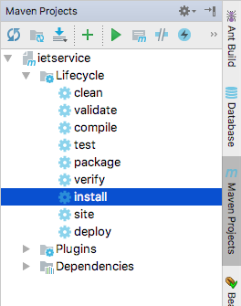
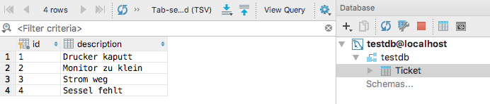

# Inbetriebnahme

## Kontrollieren, ob irgendein Container läuft
docker ps

## Starten der Datenbank
docker run --name iet_mariadb -e MYSQL_ROOT_PASSWORD=passme -d -v ~/docker/data/mysql:/var/lib/mysql -p 4306:3306 mariadb:latest

## Programmcode ändern
Im Tab "Maven Projects" - Lifecycle - install 



besser: direkt maven aufrufen
Vorbedingung: download von Maven https://maven.apache.org/download.cgi
zB: /opt/apache-maven/bin/mvn clean install && docker build -t ooe/iet_service:latest .

## Erstellen des Images für den RESTful-Service
ACHTUNG: ins Verzeichnis mit dem ```Dockerfile``` wechseln! 

Bei Verwendung von IntelliJ ist man beim Öffnen des Terminals im richtigen Verzeichnis

docker build -t ooe/iet_service:latest .

## Images löschen
docker rmi ooe/iet_service

## Starten des RESTful-Services (JBoss Wildfly)
docker run --name iet_service -e MYSQL_USER=root -e MYSQL_PASSWORD=passme -e MYSQL_DATABASE=testdb --link iet_mariadb:mysql_container -p 8080:8080 -p 9990:9990 ooe/iet_service

## Testen des RESTful-Services
curl http://localhost:8080/ietservice/rs

curl http://localhost:8080/ietservice/rs/tickets

## Testen der Datenbank
Tab "Database" - Synchronize



<br><br><br>

# Funktionalität

## Starten des Containers:

docker pull mariadb

docker run --name iet_mariadb -e MYSQL_ROOT_PASSWORD=passme -d -v ~/docker/data/mysql:/var/lib/mysql -p 4306:3306 mariadb:latest

## Stoppen des Containers
docker stop iet_mariadb

## Welche Container haben wir
docker ps

auch die gestoppten Container werden angezeigt: docker ps -a 

## Container löschen
docker rm iet_mariadb

## Images anzeigen
docker images

## Logs anzeigen
docker logs iet_mariadb

## Container build
docker build -t ooe/iet_service:latest .

## Container run
docker run --name iet_service -e MYSQL_USER=root -e MYSQL_PASSWORD=passme -e MYSQL_DATABASE=testdb --link iet_mariadb:mysql_container -p 8080:8080 -p 9990:9990 ooe/iet_service

## Container stoppen und löschen
docker ps && docker stop iet_mariadb && docker rm iet_mariadb

docker ps && docker stop iet_service && docker rm iet_service

## Auf admin-Konsole des Wildfly zugreifen
im Browser: http://localhost:9990


## Ergebnisse testen
curl http://localhost:8080/ietservice/rs

curl http://localhost:8080/ietservice/rs/tickets

curl -X GET -H "Accept: application/json" http://localhost:8080/ietservice/rs/tickets


https://goldmann.pl/blog/2014/07/23/customizing-the-configuration-of-the-wildfly-docker-image/
http://blog.arungupta.me/wildfly-javaee7-mysql-link-two-docker-container-techtip65/
https://github.com/arun-gupta/docker-images/tree/master/wildfly-mysql-javaee7


# Troubleshooting:
## Auf laufenden Container mit Terminal zugreifen
docker exec -it <containername> /bin/bash

## Auf mariadb zugreifen
```docker exec -it iet_mariadb /bin/bash
mysql -u root p
show databases;
use testdb;
show tables;```


